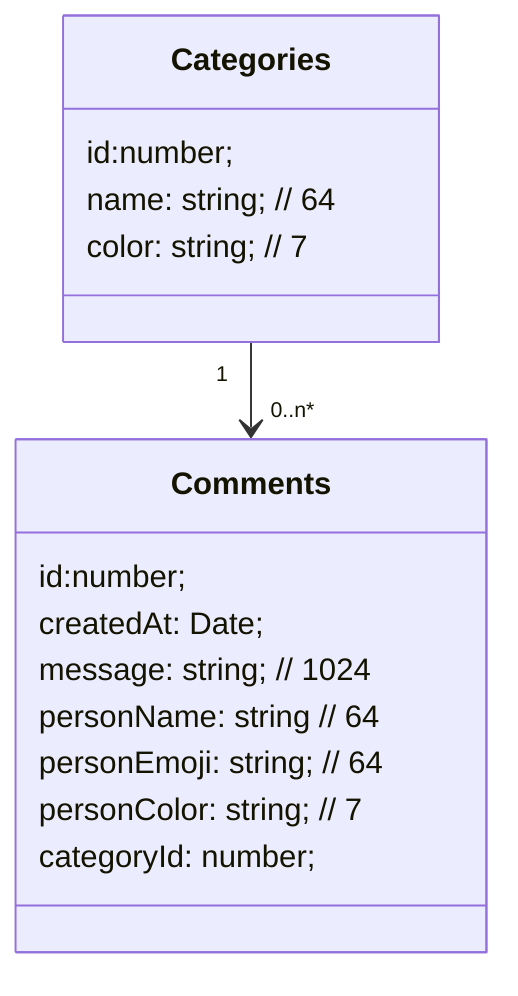

```mermaid
classDiagram

class Categories {
    id:number;
    name: string; // 64
    color: string; // 7
}

Categories "1" --> "0..n*" Comments

class Comments {
    id:number;
    createdAt: Date;
    message: string; // 1024
    personName: string // 64
    personEmoji: string; // 64
    personColor: string; // 7
    categoryId: number; 
}
```